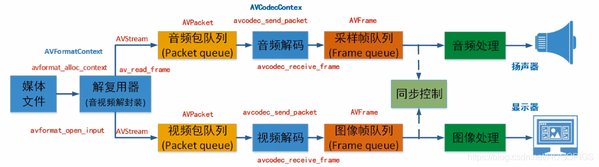
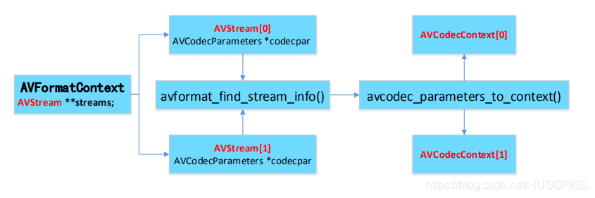

### FFmpeg常用结构体

1. 解协议(http, rtsp, rtmp, mms)
```
AVIOContext, URLProtocol, URLContext主要存储视音频使用的协议的类型以及状态。
URLProtocol存储输入视音频使用的封装格式。
每种协议都对应一个URLProtocol结构。
```
2. 解封装(flv, avi, rmvb, mp4)
```
AVFormatContext主要存储视音频封装格式中包含的信息。
AVInputFormat存储输入音视频使用的封装格式。
每种视音频格式都对应一个AVInputFormat结构。
```
3. 解码(h264, mpeg2, aac, mp3)
```
每个AVStream存储一个视频/音频流的相关数据。
每个AVStream对应一个AVCodecContext, 存储该视频/音频流使用解码方式的相关数据。
每个AVCodecContext中对应一个AVCodec, 包含该视频/音频对应的解码器。
每种解码器都对应一个AVCodec结构。
```
4. 存数据
```
视频每个结构一般存储一帧, 音频可能存储好几帧
解码前数据: AVPacket
解码后数据: AVFrame
```


***
1. AVCodec 结构体
```C++
typedef struct AVCodec
{
    // 标示 Codec 的名字, 比如，"h264" "h263" 等。
    const char *name;
    // 标示 Codec 的类型，有 video ，audio 等类型。
    enum CodecType type;
    // 标示 Codec 的 ID，有 CODEC_ID_H264 等。
    enum CodecID id;
    // 标示具体的 Codec 对应的 Context 的 size,如：H264Context。
    int priv_data_size;
    // 以下标示 Codec 对外提供的操作,每一种解码器都会实现这些操作。
    int(*init)(AVCodecContext*);
    int(*encode)(AVCodecContext *, uint8_t *buf, int buf_size, void *data);
    int(*close)(AVCodecContext*);
    int(*decode)(AVCodecContext *, void *outdata, int *outdata_size, uint8_t *buf, int buf_size);
    struct AVCodec *next;
}AVCodec;
 
// H264 的主要结构的初始化如下：
AVCodec ff_h264_decoder = {
    "h264",
    AVMEDIA_TYPE_VIDEO,
    CODEC_ID_H264,
    sizeof(H264Context),
    ff_h264_decode_init,
    NULL,
    ff_h264_decode_end,
    decode_frame
}
```
> 存储解码器信息的结构体
AVCodec是类似COM接口的数据结构，表示视音频编解码器，着重于功能函数，一种媒体类型对应一个AVCodec结构，在程序运行时有多个实例。next变量用于把所有支持的编解码器连接成链表，便于遍历查找；id确定了唯一编解码器；priv_data_size表示具体的Codec对应的Conetext结构大小，比如MsrleContext或TSContext，这些具体的结构定义散落于各个.c文件中，为避免太多的if else类语句判断类型再计算大小，这里就直接指明大小，因为这是一个编译时静态确定的字段，所以放在AVCodec而不是AVCodecContext中。

2. AVCodecContext结构体
```C++
typedef struct AVCodecContext
{
    int bit_rate;
    int frame_number;
    //扩展数据，如 mov 格式中 audio trak 中 aac 格式中 esds 的附加解码信    息。
    unsigned char *extradata;
    //扩展数据的 size
    int extradata_size;
    //视频的原始的宽度与高度
    int width, height; // 此逻辑段仅针对视频
    //视频一帧图像的格式，如 YUV420
    enum PixelFormat pix_fmt;
    //音频的采样率
    int sample_rate;
    //音频的声道的数目
    int channels;
    int bits_per_sample;
    int block_align;
    // 指向相应的解码器，如：ff_h264_decoder
    struct AVCodec *codec;
    //指向具体相应的解码器的 context，如 H264Context
    void *priv_data;
    //公共操作函数
    int(*get_buffer)(struct AVCodecContext *c, AVFrame *pic);
    void(*release_buffer)(struct AVCodecContext *c, AVFrame *pic);
    int(*reget_buffer)(struct AVCodecContext *c, AVFrame *pic);
}AVCodecContext;
```
> 描述解码器上下文的数据结构
AVCodecContext结构表示程序运行的当前Codec使用的上下文，着重于所有Codec共有的属性(并且是在程序运行时才能确定其值)和关联其他结构的字段。extrdata和extrdata_size两个字段表述了相应Codec使用的私有数据；codec字段关联相应的编解码；priv_data字段关联各个具体编解码器独有的属性context，和AVCodec结构中的priv_data_size配对使用。

3. AVInputFormat结构体
```C++
typedef struct AVInputFormat
{
    // 标示 format 的名字, 比如，“mov” “mp4” 等。
    const char *name;
    // 标示具体的 format 对应的 Context 的 size,如：MovContext。
    int priv_data_size;
    //具体的操作函数
    int(*read_probe)(AVProbeData*);
    int(*read_header)(struct AVFormatContext *,AVFormatParameters *ap);
    int(*read_packet)(struct AVFormatContext *, AVPacket *pkt);
    int(*read_close)(struct AVFormatContext*);
    struct AVInputFormat *next;
} AVInputFormat;
// Mov 或 mp4 的主要结构的初始化如下：
AVInputFormat ff_mov_demuxer = {
    "mov,mp4,m4a,3gp,3g2,mj2",
    NULL_IF_CONFIG_SMALL("QuickTime/MPEG-4/Motion JPEG 2000 format"),
    sizeof(MOVContext),
    mov_probe,
    mov_read_header,
    mov_read_packet,
    mov_read_close,
    mov_read_seek,
}
```
> 每种封装格式(例如FLV, MKV, MP4, AVI)对应一个该结构体
AVInputFormat是类似COM接口的数据结构，表示输入文件容器格式，着重于功能函数，一种文件容器格式对应一个AVInputFormat结构，在程序运行时有多个实例。next变量用于把所有支持的输入文件容器格式连接成链表，便于遍历查找。priv_data_size表示具体的文件容器格式对应的Context的大小。本例中是MovContext，这些具体的结构定义散落于各个.c文件中。

4. AVFormatContext结构体
```C++
typedef struct AVFormatContext
{
    // 指向 AVInputFormat，如对于mp4或mov为ff_mov_demuxer
    struct AVInputFormat *iformat;
    struct AVOutputFormat *oformat;
    // 指向具体的格式对应的 Context，如：MovContext。
    void *priv_data;
    // 指向数据读取统一接口 context
    ByteIOContext pb;
    // 流的数目
    int nb_streams;
    // 至少2个指针元素分别指向 video stream和audio stream
    AVStream *streams[MAX_STREAMS];
} AVFormatContext;
```
> AVFormatContext主要存储视音频封装格式中包含的信息。
AVFormatContext在FFmpeg里是一个非常重要的结构，是其他输入、输出相关信息的一个容器。描述媒体文件或媒体流构成和基本信息，封装格式上下文结构体，也是统领全局的结构体，保存了音视频文件封装格式相关信息。
作为输入容器时struct AVInputFormat* iformat不能为空，其中包含了输入文件的音视频流信息，程序从输入容器中读出音视频包进行解码处理。
作为输出容器时struct AVOutputFormat* oformat不能为空，程序把编码好的音视频包写入到输出容器中。
AVFormatContext结构表示程序运行的当前文件容器格式使用的上下文，着重于所有文件容器共有的属性(并且是在程序运行时才能确定其值)和关联其他结构的字段。iformat字段关联相应的文件容器格式，pb关联广义的输入文件，streams关联音视频流，priv_data字段关联各个具体文件容器独有的属性上下文，和priv_data_size配对使用。

5. MovContext结构体
```C++
typedef struct MovContext
{
    // 临时持有 AVFormatContext 的指针
    AVFormatContext *fc;
    // 时间缩放因子
    int time_scale;
    // 视频的时长
    int64_t duration;
    // 拆包时是否发现”moov“头
    int found_moov;
    // 拆包时是否发现"mdat"头
    int found_mdat;
    int isom;
    MOVFragment fragment;
    MOVTrackExt *trex_data;
    unsigned trex_count;
    int itunes_metadata; ///< metadata are itunes style
    int chapter_track;
} MOVContext;
```
> MovContext定义了mp4中流的一些属性

6. URLProtocol结构体
```C++
typedef struct URLProtocol
{
    const char *name;
    // 用的统一的模板函数
    int(*url_open)(URLContext *h, const char    *filename, int flags);
    int(*url_read)(URLContext *h, unsigned char     *buf, int size);
    int(*url_write)(URLContext *h, unsigned char    *buf, int size);
    offset_t(*url_seek)(URLContext *h, offset_t     pos, int whence);
    int(*url_close)(URLContext *h);
    struct URLProtocol *next;
} URLProtocol;

// ffurl_connect file 的主要结构的初始化如下：
URLProtocol ff_file_protocol = {
    .name = "file",
    .url_open = file_open,
    .url_read = file_read,
    .url_write = file_write,
    .url_seek = file_seek,
    .url_close = file_close,
    .url_get_file_handle = file_get_handle,
    .url_check = file_check,
}
```
> 存储视音频使用的协议类型以及状态
URLProtocol是类似COM接口的数据结构，表示广义的输入文件，着重于功能函数，一种广义的输入文件对应一个URLProtocol结构，比如file，pipe，tcp等等，定义了对file tcp等方式的通用模板函数。next变量用于把所有支持的广义的输入文件连接成链表，便于遍历查找。

7. URLContext结构体
```C++
typedef struct URLContext
{
    //指向相应的协议(协议为从初始化链表中注册的),如  ff_file_protocol
    struct URLProtocol *prot;
    int flags;
    int max_packet_size;
    //相应通信方式的句柄，对于文件为 fd 句柄，对于网络为socket 句柄等
    void *priv_data;
    //文件的名字，不区分本地和网络
    char *filename;
} URLContext
```
> 存储视音频使用的协议类型以及状态
URLContext结构表示程序运行的当前广义输入文件使用的context，着重于所有广义输入文件共有的属性(并且是在程序运行时才能确定其值)和关联其他结构的字段。prot字段关联相应的广义输入文件，priv_data字段关联各个具体广义输入文件的句柄。

8. AVIOContext结构体(老版本：ByteIOContext)
```C++
typedef struct ByteIOContext
{
    //数据缓冲区
    unsigned char *buffer;
    //数据缓冲 size
    int buffer_size;
    //数据读取标记指针
    unsigned char *buf_ptr, *buf_end;
    //该指针指向相应的 URLContext，关联 URLContext
    void *opaque;
    int (*read_packet)(void *opaque, uint8_t *buf, int buf_size);
    int (*write_packet)(void *opaque, uint8_t *buf, int buf_size);
    offset_t(*seek)(void *opaque, offset_t offset, int whence);
    //当前 buffer 在文件中的位置
    offset_t pos;
    //表示要进行 seek，冲刷数据
    int must_flush;
    //是否到达了文件末尾
    int eof_reached; // true if eof reached
    int write_flag;
    int max_packet_size;
    int error; // contains the error code or 0 if no error happened
} ByteIOContext;
```
> I/O上下文，通过对该变量赋值可以改变输入源或输出目的，存储视音频使用的协议类型以及状态。
ByteIOContext结构扩展URLProtocol结构内部有缓冲机制的广泛意义上的文件，改善广义输入文件的IO性能。由其数据结构定义的字段可知，主要是缓存区相关字段，标记字段，和一个关联字段opaque来完成广义文件读写操作。opaque关联字段用于关联URLContext结构，间接关联并扩展URLProtocol结构。

9. 

10. 
11. 
12. 
13.  
14.  


***
FFmpeg播放文件流程


AVFormatContext-AVStream-AVCodecContext

***