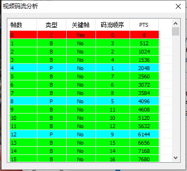

### ffmpeg源码音视频同步分析

### ffplay主要流程
>   
    1. avformat_alloc_context()
    2. avformat_open_input()
    3. avformat_find_stream_info()
    4. avcodec_parameters_to_context()
    5. avcodec_find_decoder()
    6. av_read_frame()
    7. avcodec_send_packet()
    8. avcodec_receive_frame()


### 4.2 PTS/DTS/解码过程


FFmpeg\fftools\ffplay.c
```c++
static int decoder_decode_frame(Decoder *d, AVFrame *frame, AVSubtitle *sub) {
    int ret = AVERROR(EAGAIN);

    for (;;) {
        if (d->queue->serial == d->pkt_serial) {
            do {
                if (d->queue->abort_request)
                    return -1;

                switch (d->avctx->codec_type) {
                    case AVMEDIA_TYPE_VIDEO:
                        ret = avcodec_receive_frame(d->avctx, frame);
                        if (ret >= 0) {
                            if (decoder_reorder_pts == -1) {
                                frame->pts = frame->best_effort_timestamp;
                            } else if (!decoder_reorder_pts) {
                                frame->pts = frame->pkt_dts;
                            }
                        }
                        break;
                    case AVMEDIA_TYPE_AUDIO:
                        ret = avcodec_receive_frame(d->avctx, frame);
                        if (ret >= 0) {
                            AVRational tb = (AVRational){1, frame->sample_rate};
                            if (frame->pts != AV_NOPTS_VALUE)
                                frame->pts = av_rescale_q(frame->pts, d->avctx->pkt_timebase, tb);
                            else if (d->next_pts != AV_NOPTS_VALUE)
                                frame->pts = av_rescale_q(d->next_pts, d->next_pts_tb, tb);
                            if (frame->pts != AV_NOPTS_VALUE) {
                                d->next_pts = frame->pts + frame->nb_samples;
                                d->next_pts_tb = tb;
                            }
                        }
                        break;
                }
                if (ret == AVERROR_EOF) {
                    d->finished = d->pkt_serial;
                    avcodec_flush_buffers(d->avctx);
                    return 0;
                }
                if (ret >= 0)
                    return 1;
            } while (ret != AVERROR(EAGAIN));
        }

        do {
            if (d->queue->nb_packets == 0)
                SDL_CondSignal(d->empty_queue_cond);
            if (d->packet_pending) {
                d->packet_pending = 0;
            } else {
                int old_serial = d->pkt_serial;
                if (packet_queue_get(d->queue, d->pkt, 1, &d->pkt_serial) < 0)
                    return -1;
                if (old_serial != d->pkt_serial) {
                    avcodec_flush_buffers(d->avctx);
                    d->finished = 0;
                    d->next_pts = d->start_pts;
                    d->next_pts_tb = d->start_pts_tb;
                }
            }
            if (d->queue->serial == d->pkt_serial)
                break;
            av_packet_unref(d->pkt);
        } while (1);

        if (d->avctx->codec_type == AVMEDIA_TYPE_SUBTITLE) {
            int got_frame = 0;
            ret = avcodec_decode_subtitle2(d->avctx, sub, &got_frame, d->pkt);
            if (ret < 0) {
                ret = AVERROR(EAGAIN);
            } else {
                if (got_frame && !d->pkt->data) {
                    d->packet_pending = 1;
                }
                ret = got_frame ? 0 : (d->pkt->data ? AVERROR(EAGAIN) : AVERROR_EOF);
            }
            av_packet_unref(d->pkt);
        } else {
            if (avcodec_send_packet(d->avctx, d->pkt) == AVERROR(EAGAIN)) {
                av_log(d->avctx, AV_LOG_ERROR, "Receive_frame and send_packet both returned EAGAIN, which is an API violation.\n");
                d->packet_pending = 1;
            } else {
                av_packet_unref(d->pkt);
            }
        }
    }
}
```

