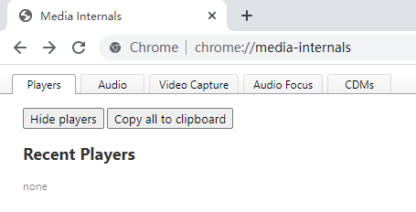
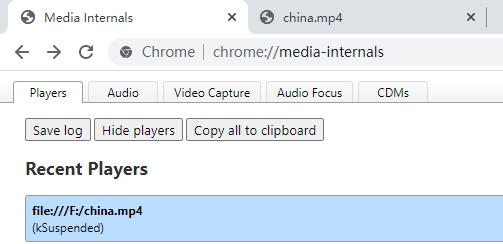
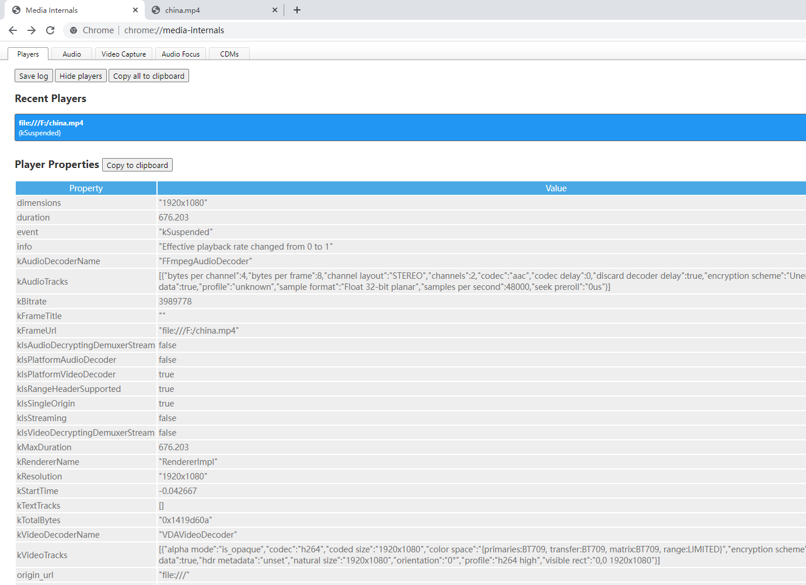
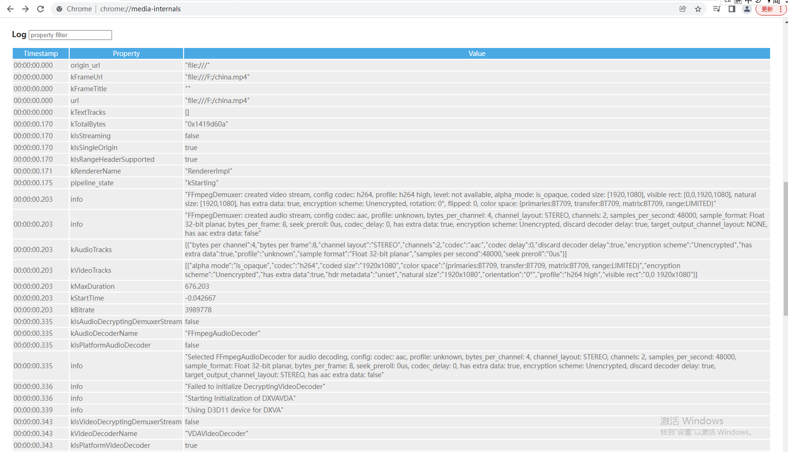

### chrome://media-internals/

- 功能
```
了解当前音视频的编码，buffer 状态等信息.
It currently displays 3 things:
1. Everything it can dig up from the media stack about active media players. 
Includes buffered data, video properties, measured times between events, 
and a log of events.

2. Status and volume of active audio streams. 
These are not yet associated with a particular tab.

3. Cache activity, including reads from and writes to the media cache.
```

- 使用
```
在浏览器中新打开网页，输入chrome://media-internals/打开界面
```


```
在浏览器中打开播放某视频，然后刷新chrome://media-internals/网页，
即可看到播放的视频信息
```


```
选中视频信息，即可看到播放的视频解码信息以及log信息。
Player Properties 和 Log
```


```
log
```
